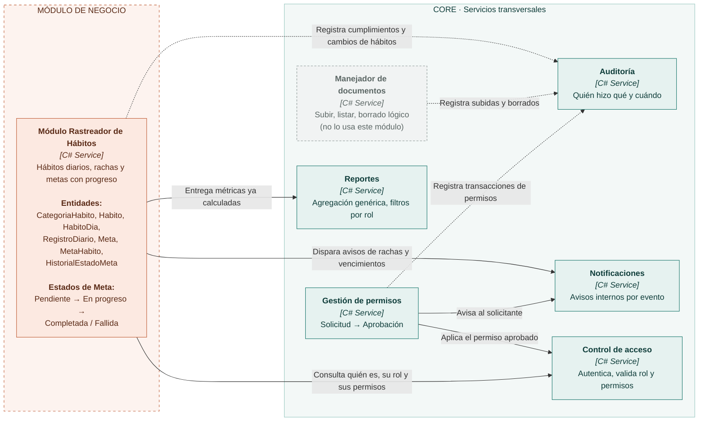

# Rastreador de hábitos con metas: diseño de componentes

PROGRAMACIÓN III · TDS-007 · ITLA · 2026-C-3

Backend: C# / ASP.NET Core (.NET). Frontend: HTML, CSS y JavaScript. Base de datos: SQL Server.

## 1. Diagrama de componentes

