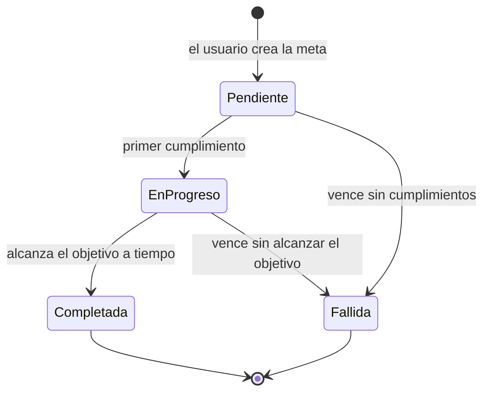

# Máquina de estados de negocio — `Meta`

Práctica 1, sección 1.6 (RF-NEG-03, RF-NEG-04, RF-NEG-05, RD-04). Se entrega la estructura;
las pruebas llegan en la semana 8.

## La entidad central

Una **Meta** agrupa uno o más hábitos de un usuario y se cumple al sumar un objetivo de
**cumplimientos antes de su fecha límite**. Ejemplo: «Hacer ejercicio 20 veces antes del
30 de noviembre».

| Atributo | Para qué |
|---|---|
| `UsuarioId` | Dueño de la meta (el Id que entrega Control de acceso) |
| `Nombre` | Descripción de la meta |
| `ObjetivoCumplimientos` | Cumplimientos necesarios para lograrla (1 o más) |
| `FechaLimite` | Último día en que cuentan los cumplimientos |
| **`Estado`** | Estado actual de la máquina |

## Dónde está en el código

| Qué | Archivo |
|---|---|
| Los estados, en un solo lugar (RF-NEG-03) | `src/Negocio/RastreadorHabitos.Modulo.Metas/Entities/EstadoMeta.cs` |
| Las transiciones, en un solo lugar (RD-04), con las prohibidas explícitas (RF-NEG-04) y los terminales (RF-NEG-05) | `src/Negocio/RastreadorHabitos.Modulo.Metas/Reglas/TransicionesMeta.cs` |
| La entidad con su atributo de estado; solo cambia de estado por `CambiarEstado`, que rechaza toda transición no permitida | `src/Negocio/RastreadorHabitos.Modulo.Metas/Entities/Meta.cs` |
| El modelo de datos: tabla `Metas.Metas`, con el estado guardado por nombre | `src/Negocio/RastreadorHabitos.Modulo.Metas/Data/MetasDbContext.cs` y `Migrations/` |

## Estados

| Estado | Significado | Terminal |
|---|---|---|
| **Pendiente** | Estado inicial: la meta recién creada no tiene ningún cumplimiento | No |
| **En progreso** | Tiene al menos un cumplimiento y todavía no alcanzó el objetivo | No |
| **Completada** | Alcanzó el objetivo antes de la fecha límite | **Sí** |
| **Fallida** | Terminó la fecha límite sin alcanzar el objetivo | **Sí** |

## Tabla de transiciones

| Desde | Hacia | Quién la ejecuta | Condición |
|---|---|---|---|
| *(creación)* | Pendiente | Usuario dueño | Crea la meta con un objetivo de 1 o más cumplimientos y una fecha límite futura |
| Pendiente | En progreso | Sistema | Se registra el primer cumplimiento de uno de sus hábitos, antes de que termine el día de la fecha límite |
| En progreso | Completada | Sistema | Los cumplimientos alcanzan el objetivo antes de que termine el día de la fecha límite |
| En progreso | Fallida | Sistema | Termina el día de la fecha límite sin alcanzar el objetivo |
| Pendiente | Fallida | Sistema | Termina el día de la fecha límite sin ningún cumplimiento |

Si un solo cumplimiento alcanza el objetivo, el sistema aplica en orden
Pendiente → En progreso → Completada.

## Transiciones prohibidas (RF-NEG-04)

| Desde | Hacia | Por qué |
|---|---|---|
| Pendiente | Completada | Toda meta lograda pasa por En progreso |
| En progreso | Pendiente | El avance no se deshace |
| Completada | En progreso | Una meta terminada no se reabre |
| Fallida | En progreso | Una meta terminada no se reabre |
| Completada | Fallida | El resultado de una meta terminada no cambia |
| Fallida | Completada | El resultado de una meta terminada no cambia |

De **Completada** y **Fallida** no sale ninguna transición: son los estados terminales
(RF-NEG-05).

